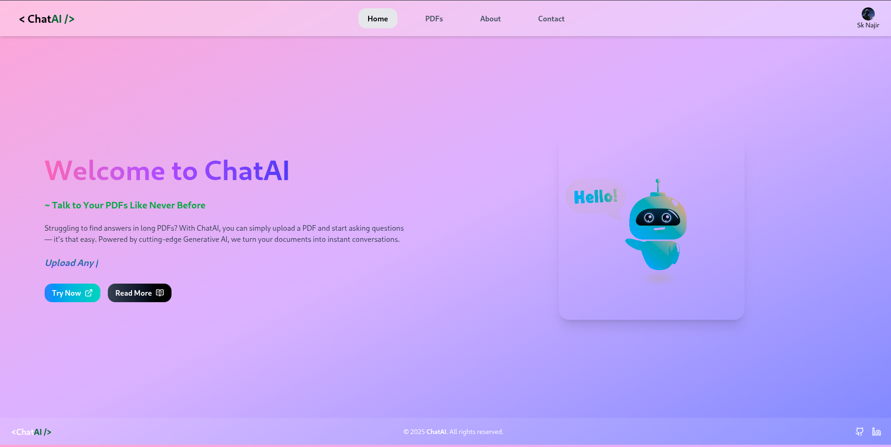
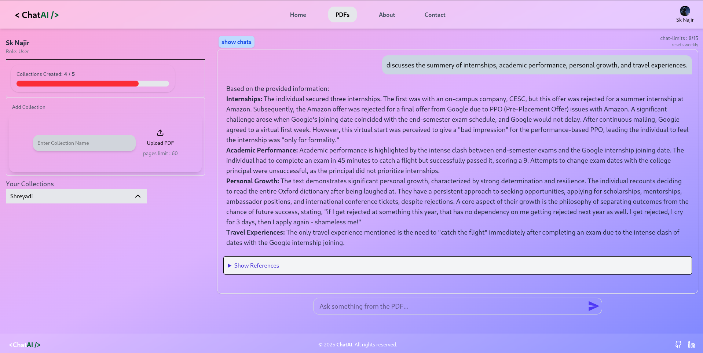

# 📄 ChatAI 🤖  
**An AI-powered PDF chat application built with Next.js, Langchain, Qdrant, Google GenAI, Clerk, Zustand, MongoDB, and BullMQ**

ChatAI is a full-stack Retrieval-Augmented Generation (RAG) system that enables users to upload and chat with their PDF documents using intelligent vector search, powered by Langchain and Google GenAI. The system supports persistent chat history.

---

🔗 **Live Demo:** [https://yourapp.vercel.app/]

---
## 📸 Preview
- Home Page 1
 
- Home Page 2
 


## ✨ Features

- 📚 **PDF Chat**: Upload a PDF and chat with its content in real time.
- 🧠 **RAG with Vector Embeddings**: Uses Langchain + Qdrant for accurate context retrieval.
- 🤖 **Gemini-powered AI**: Uses Google GenAI for conversational intelligence.
- 🔐 **Authentication**: Clerk for secure login and sign-up.
- 💬 **Interactive Chat UI**: Built with React 19 and Zustand for global state.
- 🗃️ **MongoDB Integration**: Stores user chat history persistently.
- 🌙 **Dark Mode**: Stylish TailwindCSS 4 theme with animation support.
- 🔔 **Toasts & Feedback**: `react-toastify` for clean UI notifications.

---

## 🚀 Tech Stack

| Layer        | Tech                          |
|--------------|-------------------------------|
| Frontend     | Next.js 15, React 19          |
| Backend API  | Express.js                    |
| AI Backend   | Google GenAI SDK + Langchain  |
| Embeddings DB| Qdrant                        |
| State Mgmt   | Zustand                       |
| Auth         | Clerk                         |           |
| DB           | MongoDB + Mongoose            |
| File Upload  | Multer                        |
| Styling      | TailwindCSS 4                 |
| Notifications| React Toastify                |

---

## 📦 Installation

```bash
git clone https://github.com/your-username/ChatAI.git
cd ChatAI
pnpm install
```

# 🔧 Setup Environment

- ## Clerk Auth
    ```CLERK_PUBLISHABLE_KEY=your_clerk_publishable_key
    CLERK_SECRET_KEY=your_clerk_secret_key
    NEXT_PUBLIC_CLERK_PUBLISHABLE_KEY=your_clerk_publishable_key
    ``` 
- ## MongoDB
    ```MONGODB_URI=your_mongo_connection_string```

- ## Google GenAI
    ```GOOGLE_API_KEY=your_genai_api_key```


## 🛠 Available Scripts
- ### Client
    ```
    pnpm dev     # Run in development mode
    pnpm build   # Build for production
    pnpm start   # Start production server
    ```
- ### Server
    ```
    pnpm dev     # Run Express server in dev mode with file watching
    pnpm start   # Start Express server
    ```
## 📁 Project Structure
   -  ```
        /ChatAI
        ├── /client           # Next.js Frontend
        │   ├── /components   # React components
        │   ├── /lib          # Zustand, helpers
        │   ├── /app       # Next.js pages
        │   ├── /styles       # Tailwind & global CSS
        │   └── .env.local    # Frontend environment vars
        │
        ├── /server           # Express backend
        │   ├── /routes       # API routes
        │   ├── /utils        # Langchain, Qdrant, parsing
        │   └── .env          # Server environment 
